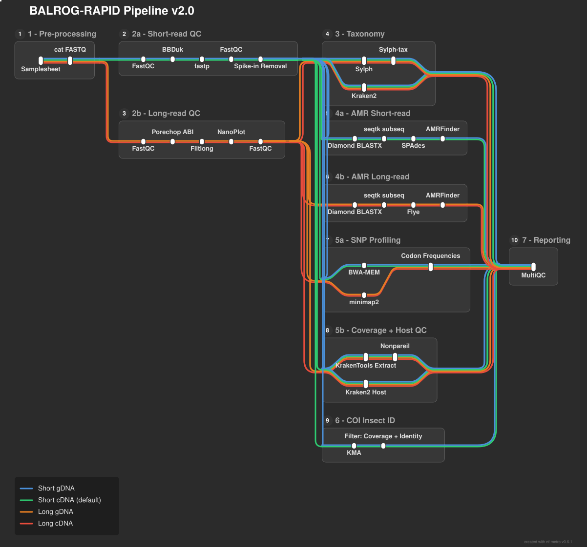

# BALROG-RAPID Nextflow Pipeline

Nextflow DSL2 pipeline for metagenomic pathogen detection, host profiling, and AMR detection, supporting both Illumina/Element short reads and Oxford Nanopore long reads.

## Requirements

- [Nextflow](https://www.nextflow.io/) >= 24.04
- Docker, Singularity, or Apptainer (all tools run in containers)

## Quick Start

Pick the container engine profile that matches your system (`docker`, `singularity`, or `apptainer`):

```bash
nextflow run main.nf \
  -profile docker \
  --sample_sheet samplesheet.csv \
  --kraken2_db /path/to/kraken2_db \
  --sylph_db /path/to/sylph.syldb \
  --diamond_db /path/to/amr.dmnd \
  --outdir ./results
```

No profile is enabled by default -- omitting `-profile` will run tools directly on `$PATH` instead of in containers.

## Samplesheet

A single unified CSV drives both short-read and long-read samples:

```csv
sample,library,molecule,r1,r2,reads
Sample1,Short,gDNA,/path/to/Sample1_R1.fastq.gz,/path/to/Sample1_R2.fastq.gz,
Sample2,Long,gDNA,,,/path/to/Sample2.fastq.gz
```

- `library`: `Short` (Illumina/Element paired-end -- uses `r1`/`r2`) or `Long` (Oxford Nanopore -- uses `reads`)
- `molecule`: free-text (e.g. `gDNA`); carried through for your own record-keeping
- **Re-sequencing**: multiple rows with the same `sample` are concatenated automatically before any QC step, as long as every row for that sample has the same `library` and `molecule`
- Short-read and long-read samples can be mixed freely in one samplesheet -- each is routed to the matching workflow (`BALROG_SHORT_READ` / `BALROG_LONG_READ`) and their MultiQC sections are merged into one report


## Pipeline Steps

Short-read (`library=Short`) and long-read (`library=Long`) samples run through separate workflows that share the same downstream shape, then merge into one MultiQC report.



Rendered with `nf-metro` (source: `docs/balrog_rapid.mmd`, mirrored at `assets/balrog_rapid.mmd`). A
static version is available at [`assets/pipeline_diagram_static.png`](assets/pipeline_diagram_static.png).


## Host Profiling (Optional)

To run Kraken2 against one or more host genomes, provide a host sheet CSV:

```bash
--host_sheet hosts.csv
```

```csv
host_name,kraken2_db
human,/path/to/kraken2_human_db
chicken,/path/to/kraken2_chicken_db
```

Each sample is classified against every host database. This is for contamination reporting only — reads are **not** filtered.

## Element Biosciences Aviti Adapter Trimming (Optional)

When sequencing on an Element Biosciences Aviti instrument, we have experinced reads containing platform-specific adapter sequences that FASTP doesn't fully remove. Enable the optional BBDuk trimming step to clean these:

```bash
nextflow run main.nf \
  -profile docker \
  --sample_sheet samplesheet.csv \
  --run_bbduk \
  ...
```

BBDuk runs **after FASTP but before FastQC (Trimmed)**, so the final QC reflects fully cleaned reads. The adapter FASTA defaults to the Element Aviti concatenated adapter file and does not need to be specified unless you have a custom one.

BBDuk trimming stats appear automatically in the MultiQC report when enabled.

The adapter FASTA is bundled in the pipeline at `assets/element_aviti_adapters.fasta`. Additinal adapter sequences can be added if reqiured.

## T. thermophilus Spike-in Removal (Optional)

When T. thermophilus is used as a spike-in control, enable Bowtie2 alignment to remove spike-in reads before downstream analysis:

```bash
nextflow run main.nf \
  -profile docker \
  --sample_sheet samplesheet.csv \
  --run_spike_in \
  ...
```

A pre-built Bowtie2 index for T. thermophilus (Strain HB27) is bundled in the pipeline at `assets/t_thermophilus_bt2/`. The step runs **after QC but before taxonomy, host profiling, and AMR detection**, so all downstream analyses use spike-depleted reads. A custom index may be required if a different strain is used.

Spike-in alignment statistics appear in the MultiQC report and per-sample stats TSV files are published to `results/spike_in/`.

To use a custom spike-in reference, build a Bowtie2 index and pass the directory:

```bash
--spike_in_bt2 /path/to/custom_bt2_index/
```

## Nonpareil Coverage Estimation (Optional)

Nonpareil estimates metagenomic sequencing coverage by analyzing read redundancy. We utilize this to anlyze the completeness of the bacterial fraction of the metagenome.

```bash
nextflow run main.nf \
  -profile docker \
  --sample_sheet samplesheet.csv \
  --run_nonpareil \
  ...
```

**Bacterial read filtering**: When taxonomy profiling is also enabled (`--run_taxonomy`, default true), Nonpareil automatically runs on **bacterial reads only**. Kraken2 output is used to extract reads classified under Bacteria (taxid 2, including all children) via KrakenTools. This removes host contamination signal that dominates coverage estimates in host-associated samples. Extraction statistics are published to `results/nonpareil/bacterial_extraction/`. When taxonomy is disabled, Nonpareil runs on the full read set.

Coverage estimates appear in the MultiQC report and raw output files are published to `results/nonpareil/`.

## Long-Read (Oxford Nanopore)

Long-read samples (`library=Long`):

1. **FastQC** on the raw reads
2. **Porechop_ABI** (`-abi` ab initio mode) -- discovers adapters de novo
3. **Filtlong** -- filters by `--filtlong_min_length` (default 1000 bp) and keeps the top `--filtlong_keep_percent` (default 90%) of reads by quality
4. **NanoPlot** + **FastQC** on the final trimmed reads

All four steps' outputs appear in the MultiQC report. Downstream (taxonomy, host profiling, AMR, Nonpareil, SNP profiling, custom QC) behaves identically to the short-read path, except AMR assembly uses **Flye** (`--flye_read_type`, default `--nano-hq`) in place of SPAdes.

## Custom QC Metrics (Optional)

Adds custom metrics to the MultiQC General Stats table. Currently reports the **percentage of reads classified as Bacteria** by Kraken2. This is useful for quickly assessing host contamination levels across samples.

```bash
nextflow run main.nf \
  -profile docker \
  --sample_sheet samplesheet.csv \
  --custom_qc \
  ...
```

Requires taxonomy profiling to be enabled (`--run_taxonomy`, default true). The "% Bacterial" column appears in the MultiQC General Stats table.

## Targeted SNP / AA Variant Profiling (Optional)

Profiles amino acid variant frequencies at specific codon positions in target genes. Designed for surveillance of known resistance-associated or adaptive mutations in pooled samples.

```bash
nextflow run main.nf \
  -profile docker \
  --sample_sheet samplesheet.csv \
  --run_snp_profiling \
  --snp_cds_fasta /path/to/target_genes.fasta \
  --snp_positions_csv /path/to/positions.csv \
  ...
```

**Input files:**

1. **CDS FASTA** (`--snp_cds_fasta`): Nucleotide coding sequences of target genes. Each sequence must start at ATG (no UTRs). FASTA header names must match `gene_name` in the positions CSV.

2. **Positions CSV** (`--snp_positions_csv`): Defines which protein positions to profile:
   ```csv
   gene_name,protein_position,wt_aa,mutant_aas,annotation
   gyrA,83,S,L;A,Fluoroquinolone resistance
   gyrA,87,D,N;G;Y,Fluoroquinolone resistance
   parC,80,S,I;R,Fluoroquinolone resistance
   ```
   - `protein_position`: 1-based amino acid position
   - `wt_aa`: Expected wild-type amino acid (single letter)
   - `mutant_aas`: Semicolon-separated known mutant amino acids
   - `annotation`: Free text describing the variant. Used in reporting

Reads are aligned to the CDS reference using BWA-MEM (short reads) or minimap2 (long reads). Per-read codon triplets are extracted at each specified position using pysam, translated to amino acids, and tallied to produce frequency distributions. Quality filters (`--snp_min_base_quality`, `--snp_min_mapq`) ensure only high-confidence bases contribute.

**MultiQC output:** General Stats columns show positions profiled, mutants detected, and depth statistics. A detail table lists per-position amino acid and codon frequency distributions with low-depth warnings.

## COI Insect ID (Optional, short reads only)

Identifies the insect host from shotgun metagenomic reads using KMA against a reference set.

```bash
nextflow run main.nf \
  -profile docker \
  --sample_sheet samplesheet.csv \
  --run_coi_id --kma_db /path/to/bold_coi_diptera_v5 \
  ...
```

**Database** (built separately, not by this pipeline -- copy, do not rebuild): `--kma_db`, a directory containing the KMA index (`<prefix>.comp.b`, `.length.b`, `.seq.b`, `.name`; the prefix is auto-detected).

**Both coverage and identity are required -- neither works alone on COI.** A 658bp COI barcode is tiled by only ~3 short read pairs, so coverage saturates fast: a wrong-family reference has been observed reaching 100% coverage at just 84% identity, in every one of 12 real test libraries. Conversely, a single read landing on a conserved stretch reaches 100% identity at ~3% coverage. Default floors: `Template_Coverage >= 95` AND `Query_Identity >= 95` (`--coi_min_coverage`, `--coi_min_identity`, both tunable) -- reproducible, not fully calibrated; validated on gDNA from six specimens, and known to fail on cDNA (see below).

**BIN, not species, is often the only stable identifier.** 67% of BOLD COI records carry no species-level name, so each call reports the BOLD BIN (e.g. `BOLD:AFY8455`) alongside whatever taxon name is available. Depth is always reported next to coverage, since 100% coverage of a 658bp barcode can come from as few as ~10 reads.

**A sample with no confident call is a real result, not a failure.** It occurred in 1 of 12 real libraries in validation -- the correct organism was present, just under the floors (see cDNA note below). The detail table reports "no confident hits" rather than being silently dropped or empty.

**Optional lineage join:** pass `--coi_lineage_table /path/to/coi5p_derep_corrected.tsv` (the *corrected* BOLD dereplication table) to attach full kingdom-through-species lineage to each call, built once and joined in automatically. Without it, calls still report BIN and whatever taxon name KMA's own reference header carries.

**cDNA note:** the control region is not transcribed, so cDNA coverage runs systematically lower than gDNA from the same specimen -- a known false negative in validation had the correct organism at 82.5% coverage / 94.8% identity, under both floors, while its gDNA counterpart called the same organism at 100%/95.6%. cDNA needs its own (currently uncalibrated) thresholds; treat a cDNA "no call" with that in mind.

## Parameters

| Parameter | Default | Description |
|-----------|---------|-------------|
| `--sample_sheet` | required | Unified CSV: sample,library,molecule,r1,r2,reads |
| `--kraken2_db` | required | Path to unified Kraken2 database |
| `--sylph_db` | required | Path to Sylph database (.syldb) |
| `--diamond_db` | required | Path to Diamond AMR database (.dmnd) |
| `--outdir` | `./results` | Output directory |
| `--host_sheet` | null | Optional CSV of host databases |
| `--k2_confidence` | 0.3 | Kraken2 confidence threshold |
| `--k2_min_hit_groups` | 3 | Kraken2 minimum hit groups |
| `--fastp_q` | 20 | FASTP minimum quality score (short reads) |
| `--fastp_minlen` | 100 | FASTP minimum read length (short reads) |
| `--diamond_evalue` | 1e-10 | Diamond E-value threshold |
| `--diamond_max_targets` | 500 | Diamond max target sequences |
| `--run_qc` | true | Enable/disable read QC |
| `--run_bbduk` | false | Enable BBDuk adapter trimming (Element Aviti, short reads) |
| `--bbduk_adapters` | bundled | Path to adapter FASTA for BBDuk |
| `--bbduk_ktrim` | `r` | BBDuk kmer trim direction |
| `--bbduk_hdist` | 1 | BBDuk Hamming distance tolerance |
| `--bbduk_additional_args` | `''` | Extra bbduk.sh arguments |
| `--run_spike_in` | false | Enable T. thermophilus spike-in removal (short reads only) |
| `--spike_in_bt2` | bundled | Path to pre-built Bowtie2 index directory |
| `--filtlong_min_length` | 1000 | Filtlong minimum read length to keep (long reads) |
| `--filtlong_keep_percent` | 90 | Filtlong: keep top N% of reads by quality (long reads) |
| `--flye_read_type` | `--nano-hq` | Flye read-type flag (use `--nano-raw` for older R9 chemistry) |
| `--run_nonpareil` | true | Enable/disable Nonpareil coverage estimation |
| `--custom_qc` | false | Enable custom QC metrics (% bacterial reads) |
| `--run_snp_profiling` | false | Enable targeted SNP/AA variant profiling |
| `--snp_cds_fasta` | null | CDS nucleotide FASTA of target genes |
| `--snp_positions_csv` | null | CSV: gene_name,protein_position,wt_aa,mutant_aas,annotation |
| `--snp_min_base_quality` | 20 | Minimum per-base quality (Phred) for codon extraction |
| `--snp_min_mapq` | 30 | Minimum mapping quality for read inclusion |
| `--snp_min_depth` | 10 | Minimum codon depth for confident reporting |
| `--run_coi_id` | false | Enable COI insect ID via KMA against BOLD COI (short reads only) |
| `--kma_db` | null | Directory containing the KMA index |
| `--coi_lineage_table` | null | Optional: corrected BOLD derep TSV, for joining full lineage onto calls |
| `--coi_min_coverage` | 95.0 | Template_Coverage floor -- below this a COI call is rejected |
| `--coi_min_identity` | 95.0 | Query_Identity floor -- below this a COI call is rejected |
| `--run_taxonomy` | true | Enable/disable taxonomy profiling |
| `--run_host_profiling` | true | Enable/disable host profiling |
| `--run_amr` | true | Enable/disable AMR detection |
| `--run_multiqc` | true | Enable/disable MultiQC report |
| `--multiqc_config` | built-in | Path to custom MultiQC config YAML |
| `--max_cpus` | 36 | Maximum CPUs per process |
| `--max_memory` | 750.GB | Maximum memory per process |
| `--max_time` | 24.h | Maximum time per process |

## Output Structure

Short-read and long-read samples publish into the same directory layout (Kraken2, Sylph, AMR, etc. are keyed by `{sample}`, not by read type):

```
results/
├── qc/
│   ├── fastqc_raw/
│   ├── fastp/                                   # short reads
│   ├── bbduk/                                   # short reads, only when --run_bbduk
│   ├── porechop_abi/                            # long reads
│   ├── filtlong/                                # long reads
│   ├── nanoplot/                                # long reads
│   └── fastqc_trimmed/
├── spike_in/                                      # short reads only, when --run_spike_in
│   ├── {sample}_spike_stats.tsv
│   └── {sample}_bowtie2_spike.log
├── nonpareil/                                     # only when --run_nonpareil (on by default)
│   ├── {sample}.npo
│   ├── {sample}.npa
│   └── bacterial_extraction/                      # only when taxonomy + nonpareil both enabled
│       └── {sample}_bacterial_extraction_stats.tsv
├── taxonomy/
│   ├── kraken2/{sample}_k2report.tsv
│   └── sylph/{sample}_profile.tsv
├── host/
│   └── kraken2/{sample}_{host}_k2report.tsv
├── snp_profiling/                                  # only when --run_snp_profiling
│   ├── alignments/{sample}_snp.bam
│   └── codon_freqs/{sample}_codon_freqs.tsv
├── amr/
│   ├── diamond/{sample}_diamond_hits.tsv
│   ├── extracted_reads/{sample}_amr_R{1,2}.fastq.gz   # short reads
│   ├── extracted_reads/{sample}_amr_reads.fastq.gz    # long reads
│   ├── assemblies/{sample}_contigs.fasta              # SPAdes (short) or Flye (long)
│   └── amrfinder/{sample}_amrfinder.tsv
├── coi_id/                                          # short reads only, when --run_coi_id
│   ├── kma/{sample}.res, {sample}.mapstat           # per-template coverage/identity/depth + read counts
│   └── bold_lineage.tsv                             # only when --coi_lineage_table is set
├── multiqc/
│   ├── multiqc_report.html
│   └── multiqc_data/
└── pipeline_info/
    └── software_versions.yml
```


## Containers

All processes run in containers. No local tool installation needed -- pick a profile (`-profile docker`, `-profile singularity`, or `-profile apptainer`) to enable one.

| Tool | Container |
|------|-----------|
| FastQC | `quay.io/biocontainers/fastqc:0.12.1--hdfd78af_0` |
| FASTP | `biocontainers/fastp:v0.20.1_cv1` |
| Kraken2 | `quay.io/biocontainers/kraken2:2.17.1--pl5321h077b44d_0` |
| Sylph | `quay.io/biocontainers/sylph:0.9.0--ha6fb395_0` |
| Sylph-tax | `quay.io/biocontainers/sylph-tax:1.8.0--pyhdfd78af_0` |
| Diamond | `quay.io/biocontainers/diamond:2.1.24--hf93d47f_0` |
| seqtk | `quay.io/biocontainers/seqtk:1.5--h577a1d6_1` |
| SPAdes (short-read AMR assembly) | `quay.io/biocontainers/spades:3.15.5--h5fb382e_3` |
| AMRFinderPlus | `ncbi/amr:4.2.7-2026-05-15.1` (official NCBI image -- bundles a matching AMRFinderPlus database) |
| Bowtie2 + Samtools (Spike-in) | `quay.io/biocontainers/mulled-v2-229691629e0b12c862d76101f90a597d5c1c81d4:484c804e1d5952c9023891b6f9a19f7f15815145-0` (Bowtie2 2.4.5 + Samtools 1.16.1) |
| KrakenTools | `quay.io/biocontainers/krakentools:1.2.1--pyh7e72e81_0` |
| Nonpareil | `quay.io/biocontainers/nonpareil:3.5.5--r44h077b44d_2` |
| BBMap (BBDuk) | `quay.io/biocontainers/bbmap:39.91--h09cc210_0` |
| Ubuntu (FASTQ concatenation) | `ubuntu:22.04` |
| Porechop_ABI (ONT adapter trimming) | `quay.io/biocontainers/porechop_abi:0.5.1--py311h2de2dd3_0` |
| Filtlong (ONT length/quality filtering) | `quay.io/biocontainers/filtlong:0.3.1--h077b44d_0` |
| NanoPlot (ONT QC) | `quay.io/biocontainers/nanoplot:1.46.2--pyhdfd78af_1` |
| Flye (long-read AMR assembly) | `quay.io/biocontainers/flye:2.9.6--py311h2de2dd3_0` |
| BWA + Samtools (SNP, short-read alignment) | `quay.io/biocontainers/mulled-v2-fe8faa35dbf6dc65a0f7f5d4ea12e31a79f73e40:219b6c272b25e7e642ae3ff0bf0c5c81a5135ab4-0` |
| minimap2 + Samtools (SNP, long-read alignment) | `quay.io/biocontainers/mulled-v2-66534bcbb7031a148b13e2ad42583020b9cd25c4:e1ea28074233d7265a5dc2111d6e55130dff5653-2` |
| pysam (Codon Extraction) | `quay.io/biocontainers/mulled-v2-480c331443a1d7f4cb82aa41315ac8ea4c9c0b45:3e0fc1ebdf2007459f18c33c65d38d2b031b0052-0` |
| KMA (COI insect ID) | `quay.io/biocontainers/kma:1.6.13--h118bc1c_0@sha256:90e6...` (digest-pinned) |
| MultiQC | `quay.io/biocontainers/multiqc:1.33--pyhdfd78af_0` |
